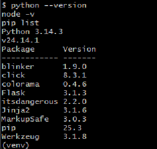

# SID-A

**SID-A: Sistema Integrado Digital da Amazônia**

## 📌 Descrição

O SID-A é um sistema de monitoramento logístico voltado para pequenas embarcações em regiões ribeirinhas com conectividade limitada.

A solução permite registrar eventos de viagem (início, parada e entrega), armazenar dados offline e sincronizar automaticamente quando houver conexão.

## 🎯 Problema

Pequenos varejistas não possuem visibilidade sobre o transporte de mercadorias, o que gera:

- incerteza nas entregas
- dificuldade de planejamento
- riscos operacionais (paradas e desvios)

## 💡 Solução

***Sistema baseado em:***

- registro de eventos de viagem
- armazenamento offline
- sincronização automática
- visualização em mapa
- previsão de chegada (ETA)

## 🧱 Arquitetura

- Dispositivo embarcado (simulado)
- Backend (API)
- Frontend Web (PWA)
- Banco de dados

## 📁 Estrutura do Projeto

- docs/ → documentação técnica
- frontend/ → interface web
- backend/ → API → simulação (script)
- hardware/ → simulação do dispositivo  → conceitual
- prototipo/ → design de interface, telas e UX (Figma)

## 🚀 Tecnologias (Planejadas)

- Backend: Python (FastAPI)
- Frontend: React (PWA)
- Banco: PostgreSQL
- Mapas: Leaflet (a definir )

## ⚙️ Configuração do Ambiente

**Pré-requisitos**
- Node.js 24.14.1
- Python 3.14.3 
- Visual Studio Code (editor recomendado)

## 📊 Status

Projeto em fase de modelagem (AV1)
