# Protótipo
Este protótipo tem como objetivo validar visualmente a interação entre usuários e o sistema SID-A,
considerando limitações de conectividade e necessidade de simplicidade operacional.

1. Visão Geral

O protótipo do SID-A (Sistema Integrado Digital da Amazônia) representa a interface de um sistema de monitoramento logístico voltado para ambientes com conectividade intermitente.

O objetivo do protótipo é demonstrar:

- A navegação entre funcionalidades
- A visualização de encomendas e rastreamento
- A interação dos diferentes perfis de usuário

2. Ferramenta Utilizada
- Figma (prototipação de interface)
- Design responsivo (Desktop e Mobile)
- PWA 

3. Perfis de Usuário Simulados

O sistema contempla quatro perfis:

- Varejista
- Cliente Final
- Barqueiro
- Administrador

Cada perfil possui diferentes permissões dentro do sistema.

4. Estrutura das Telas

O protótipo é composto pelas seguintes telas:

- Tela de Login
- Dashboard (Varejista / Cliente Final)
- Tela de Encomendas
- Tela de Detalhamento (Mapa e ETA)
- Tela do Barqueiro
- Tela do Administrador
- Tela de Perfil / Configurações / Suporte

5. Navegação do Protótipo

Fluxo principal:

- Login → Dashboard
- Dashboard → Encomendas (expandir ou acessar detalhe)
- Dashboard → Mapa (rastreamento)
- Menu superior → Perfil / Configurações / Suporte

Para o administrador:

- Dashboard → Gerenciar usuários
- Dashboard → Criar viagem
- Dashboard → Embarcações

6. Principais Funcionalidades Demonstradas

- Visualização de encomendas vinculadas ao usuário
- Rastreamento baseado em dados sincronizados
- Exibição de alertas logísticos
- Gestão de viagens (Administrador)
- Registro de eventos (Barqueiro -> opcional)

7. Observações sobre o Protótipo

- O protótipo não representa integração real com hardware
- A sincronização DTN é simulada conceitualmente
- O foco está na validação de interface e fluxo de uso

## Telas do Sistema

### 1. Tela de Login

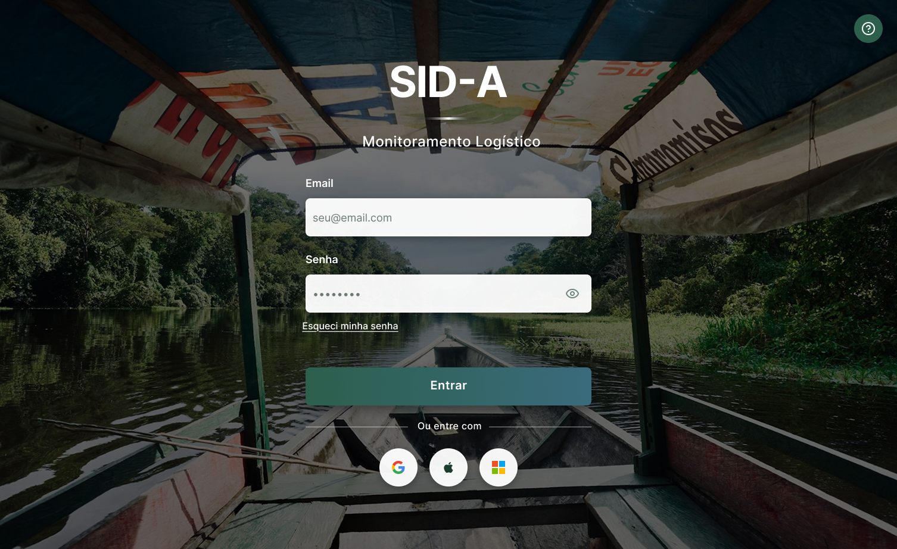

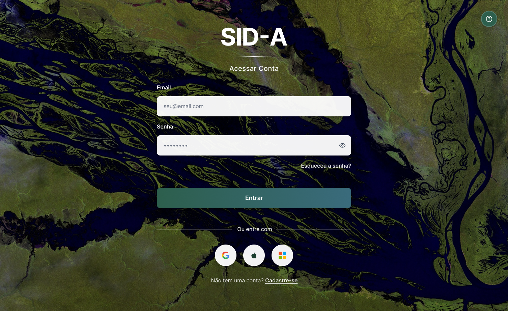

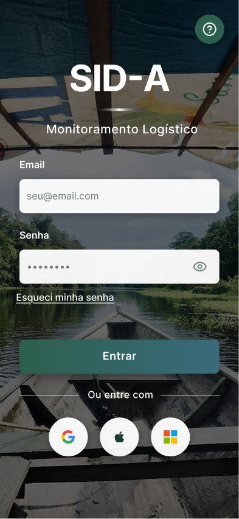

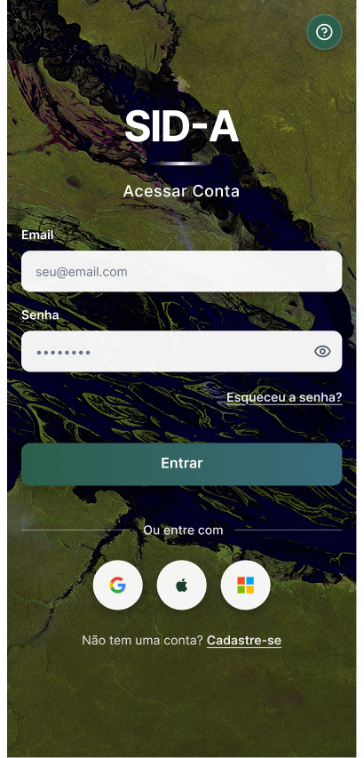
### 2. Dashboard
[imagem]

### 3. Encomendas
[imagem]

### 📱 Experiência Principal do Usuário (Core Flows)

Esta seção apresenta as telas comuns a todos os usuários da plataforma.

### 🎨 Temas e Acesso (Login & Cadastro)
*Apresentação dos temas e fluxos de entrada.*

| Login (Tema 1) | Login (Tema 2) | Cadastro (Tema 1) | Cadastro (Tema 2) |
| :---: | :---: | :---: | :---: |
|  | 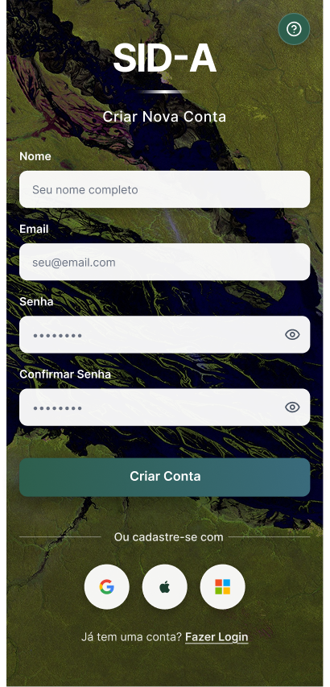 |  |  |

---

### 👤 Usuário e Suporte
*Gerenciamento de conta e canais de ajuda.*

| Perfil | Configurações | Suporte |
| :---: | :---: | :---: |
| 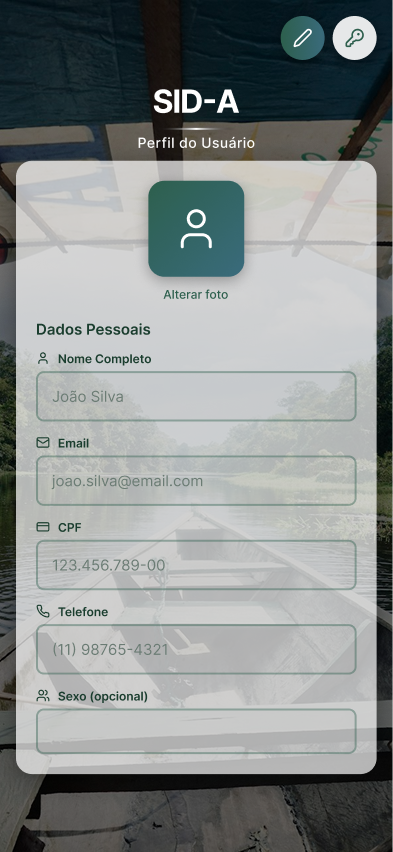 | 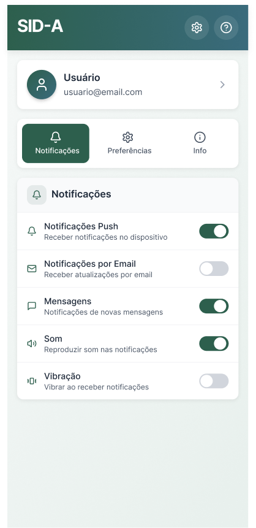 | 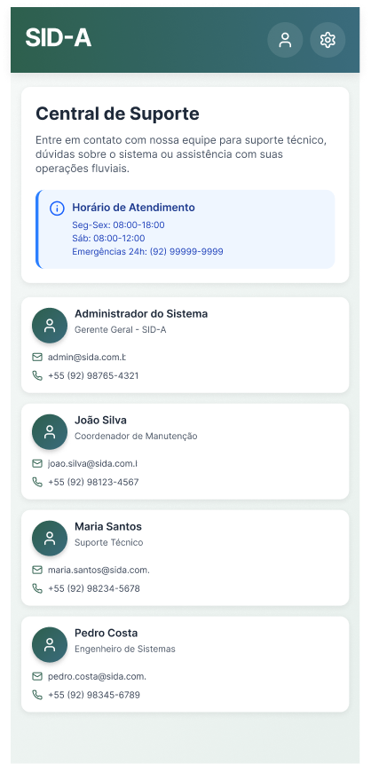 |

---

### 📊 Dashboards por Perfil
*Interfaces específicas para cada tipo de atuação no sistema.*

| Administrador | Barqueiro | Varejista / Cliente |
| :---: | :---: | :---: |
| 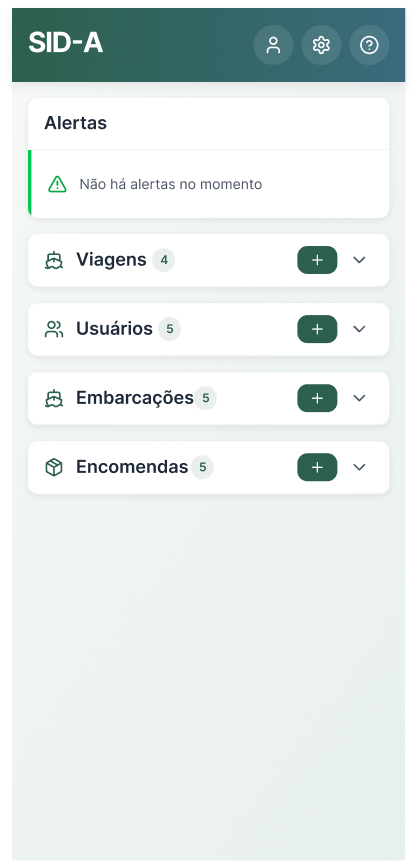 | 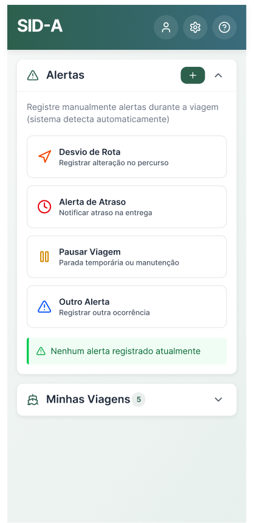 | 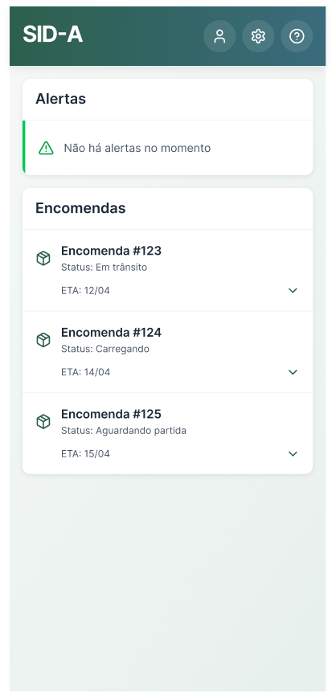 |

---

### 💡 Notas de Design
* **Responvidade:** Todas as telas foram adaptadas para dispositivos móveis com foco em toque e legibilidade.
* **Componentização:** Uso de componentes reutilizáveis para garantir a consistência entre os temas.

